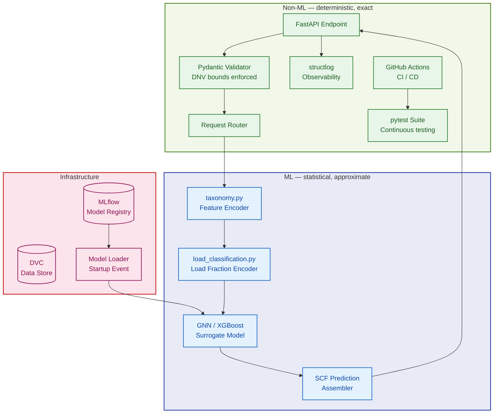
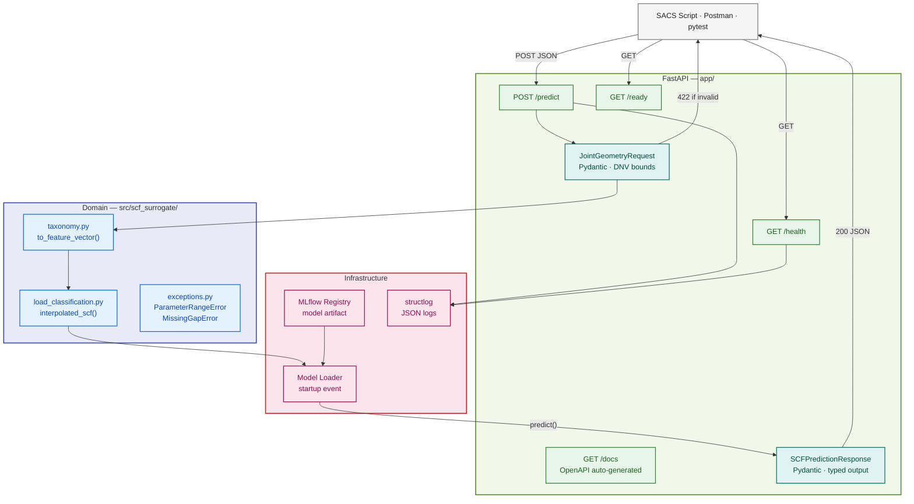
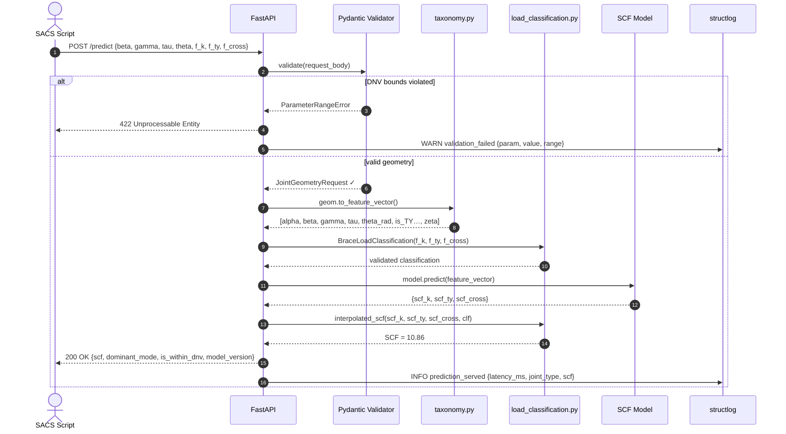
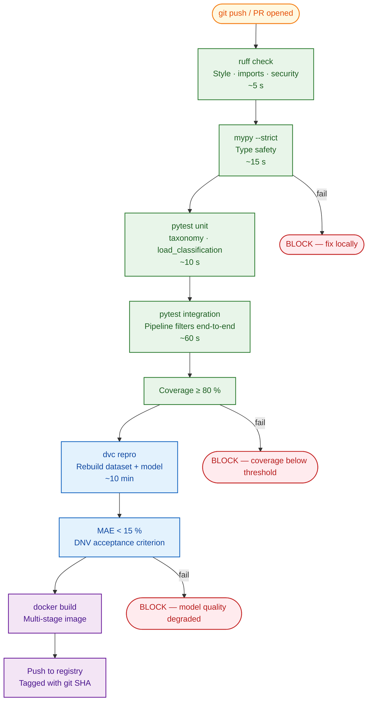
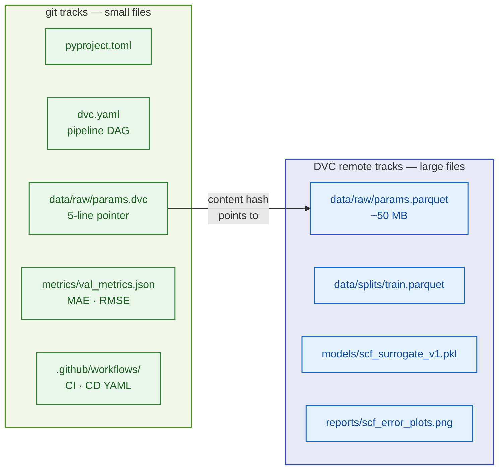

# SCF Surrogate — System Architecture

> **Project:** Offshore Tubular Joint SCF Prediction  
> **Compliance:** DNV-RP-C203 (2021) · API RP 2A-WSD (22nd Ed.)  
> **Version:** 0.1.0 · **Author:** Navin

---

## 1. System Overview

The SCF Surrogate is a two-layer ML system. The **offline layer** generates
data and trains the model. The **online layer** serves predictions through a
validated REST API. Both layers share a common domain logic library (`src/`).

The core engineering problem: replace 4–8 hour solid FEM analyses with
sub-50ms validated predictions for offshore jacket fatigue assessments.

---

## 2. ML vs Non-ML Boundary

The most important architectural boundary in any ML system. Everything inside
the ML boundary is statistical and approximate. Everything outside is
deterministic and must be exact.



> **Rule:** Dependencies point inward only.  
> `app/` → `src/` · `pipelines/` → `src/` · `src/` → nothing in this repo.

---

## 3. Offline Training Pipeline — Pipe-and-Filter Pattern

Each stage is a **pure filter**: typed input → typed output, independently
testable, DVC-tracked. If only one filter changes, only that filter and
its downstream stages re-run. Upstream results are cached by content hash.

```mermaid
flowchart LR
    classDef filter fill:#fff3e0,stroke:#e65100,stroke-width:1.5px,color:#bf360c
    classDef store  fill:#e8eaf6,stroke:#3949ab,stroke-width:1.5px,color:#1a237e
    classDef model  fill:#e3f2fd,stroke:#1565c0,stroke-width:1.5px,color:#0d47a1

    F1([" 1 · Sampler\nLatin Hypercube\nN = 10 000 "]):::filter
    F2([" 2 · DNV Validator\ntaxonomy.py\nRejects out-of-range "]):::filter
    F3([" 3 · Efthymiou Labeller\nSCF per brace\nper load location "]):::filter
    F4([" 4 · Load Classifier\nload_classification.py\nf_K · f_TY · f_cross "]):::filter
    F5([" 5 · Feature Encoder\nStandardScaler\nFixed-length vector "]):::filter
    F6([" 6 · Splitter\n70 / 15 / 15\nStratified by joint type "]):::filter
    TR([" 7 · Trainer\nGNN / XGBoost\nMLflow tracked "]):::model

    S1[(raw_params\n.parquet)]:::store
    S2[(validated\n.parquet)]:::store
    S3[(labelled\n.parquet)]:::store
    S4[(classified\n.parquet)]:::store
    S5[(features\n.parquet)]:::store
    S6[(train · val · test\n.parquet)]:::store
    S7[(model\nartifact)]:::store

    F1 --> S1 --> F2 --> S2 --> F3 --> S3 --> F4
    F4 --> S4 --> F5 --> S5 --> F6 --> S6 --> TR --> S7
```



**Data quality invariants enforced at every store boundary:**
- No SCF value < 1.0 (physical impossibility — concentration not reduction)
- No parameter outside DNV validity range enters the model
- No NaN in any feature column
- Train + Val + Test = 100% of validated samples

---

## 4. Online Serving Layer — Microservice Pattern

The serving layer is **stateless**: it loads a frozen model artifact at
startup and answers HTTP requests. It has no knowledge of training code.
Model version updates do not require redeployment — only a config change.



---

## 5. Request Lifecycle — End to End

One prediction request, traced through every component.



---

## 6. CI/CD Contract — What Each Gate Enforces

Each job in the pipeline is a **contract**, not just a step.
The order is deliberate: cheapest checks first, most expensive last.



> **Why this order:**  
> A type error caught by mypy in 15 s avoids wasting 60 s on tests that
> will fail anyway. The ML quality gate runs last because retraining is
> expensive — only pay that cost after all cheap correctness checks pass.

---

## 7. Repository Structure

```
scf-surrogate/
│
├── src/scf_surrogate/          ← domain logic (no ML framework)
│   ├── exceptions.py           ← central exception hierarchy
│   └── joints/
│       ├── taxonomy.py         ← JointType · TubularJointGeometry · validate_dnv_bounds
│       └── load_classification.py  ← BraceLoadClassification · interpolated_scf
│
├── pipelines/                  ← offline: data generation + training
│   ├── filters/                ← one module per Pipe-and-Filter stage
│   └── training/               ← GNN/XGBoost trainer + evaluator
│
├── app/                        ← online: FastAPI serving layer
│   ├── schemas/                ← Pydantic request + response models
│   └── routes/                 ← /predict · /health · /ready
│
├── tests/
│   ├── unit/                   ← fast, no I/O, milliseconds
│   ├── integration/            ← component interactions, seconds
│   └── e2e/                    ← full pipeline, minutes (CI only)
│
├── docs/
│   ├── adr/                    ← Architecture Decision Records
│   ├── standards/              ← DNV · API RP 2A summaries
│   └── runbooks/               ← deploy · dev setup · incident response
│
├── data/                       ← DVC-managed (not in git)
├── models/                     ← DVC-managed (not in git)
├── metrics/                    ← JSON metrics (in git — tiny files)
├── configs/                    ← YAML configuration (no hardcoded values)
├── .github/workflows/          ← ci.yml · cd.yml
├── Dockerfile                  ← multi-stage build
└── docker-compose.yml          ← API + MLflow for local dev
```

---

## 8. Data Versioning Strategy



**Why `metrics/` goes in git but `data/` does not:**  
Metrics are tiny JSON files — a few hundred bytes. Committing them means
`git log metrics/val_metrics.json` shows exactly how model quality changed
with every commit. This is how you write the results section of your paper.

---

## 9. Key Design Decisions

| Decision | Choice | Rationale |
|---|---|---|
| Serving pattern | Microservice (FastAPI) | Language-agnostic HTTP interface; SACS, Matlab, Excel can all call it |
| Pipeline pattern | Pipe-and-Filter (DVC) | Each filter independently testable; reproducibility structural not procedural |
| Validation boundary | Pydantic at API entry | DNV bounds enforced once, at the network boundary, not scattered in callers |
| Data generation | Efthymiou equations | Analytical ground truth; no historical data required |
| Model first choice | XGBoost → GNN | XGBoost establishes interpretable baseline; GNN captures topology effects |
| Reproducibility | DVC + MLflow + git SHA | Every prediction traceable to exact data version, code version, run ID |
| Exception hierarchy | Central `exceptions.py` | All domain errors inherit from `SCFSurrogateError`; callers catch one base type |

---

*See `docs/adr/` for full Architecture Decision Records with context and alternatives considered.*